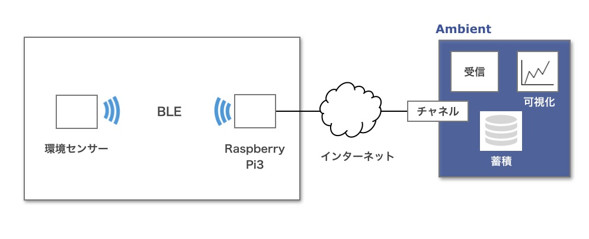

# EnvSensorBleGw

環境センサーで測定した温度、湿度などのデーターをBluetooth Low Energy (BLE) でRaspberry Pi3に取り込み、[IoTデーター可視化サービス「Ambient」](https://ambidata.io)に送信するシステム。

* src/env2ambientCS.py: オムロンの環境センサー「2JCIE-BL01」をスキャン、コネクトして温度、湿度、気圧、照度、UV、騒音、電池電圧データーを取得し、Ambientに送信する。
* src/env2ambientBS.py: オムロンの環境センサー「2JCIE-BL01」をブロードキャストモードに設定し、アドバタイズデーターに載せた温度、湿度、気圧、照度、UV、騒音、電池電圧データーを取得してAmbientに送信する。
